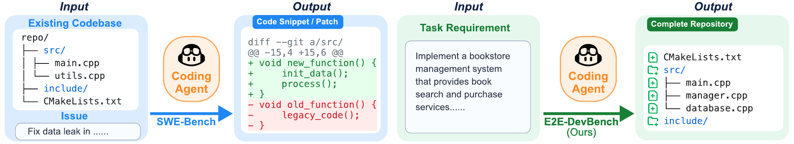
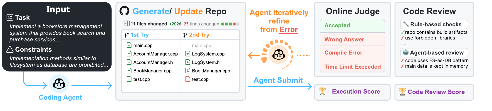
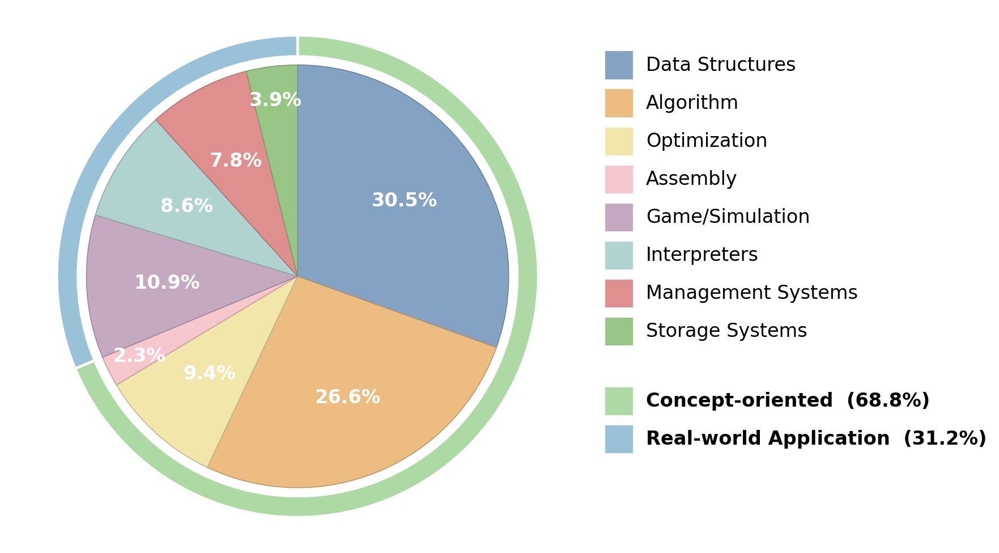

# ProjDevBench

> **Anonymous submission.** This repository is released anonymously to accompany a double-blind paper submission. Author information, the project homepage, and a public release URL will be added upon acceptance.

**ProjDevBench** (Project Development Benchmark) is a benchmark platform for evaluating AI coding agents on end-to-end project development tasks. Unlike existing benchmarks that focus on issue-level bug fixing, ProjDevBench evaluates agents on their ability to construct complete, executable software repositories from high-level specifications.

<p align="center">
  
</p>

<p align="center">
  <em>Task comparison: ProjDevBench evaluates end-to-end repository construction from project-level requirements, unlike benchmarks that modify pre-existing codebases.</em>
</p>

## Key Features

- **End-to-end project construction.** Agents build complete repositories from scratch, not just patches or single files.
- **128 curated problems.** Spanning 8 categories grouped into two super-categories — *Concept-oriented* (Data Structures, Algorithm, Optimization, Assembly) and *Real-world Application* (Game/Simulation, Interpreters, Management Systems, Storage Systems).
- **Multi-framework support.** Evaluations cover Claude Code, Codex CLI, OpenHands, and Gemini CLI; we report results for 15 (framework, model) combinations.
- **Dual evaluation protocol.** Online Judge (OJ) execution-based testing combined with LLM-assisted code review (CR).
- **Multi-submission scoring.** `Exec` aggregates the best run within a per-problem submission budget; `Exec@1` reports the first non-aborted submission per subproblem.
- **Diagnostic feedback.** Fine-grained verdict-level signals (Wrong Answer, TLE, MLE, Runtime Error, etc.).
- **Containerized execution.** Docker-based isolated environments for reproducible runs.
- **Git integration.** Each evaluation creates a GitHub repository tracking the agent's complete problem-solving process.

<p align="center">
  
</p>

<p align="center">
  <em>Overview of the ProjDevBench evaluation pipeline.</em>
</p>

## Benchmark Statistics

| Metric | Value |
|--------|-------|
| Total Problems | **128** |
| Categories | 8 (grouped into 2 super-categories) |
| Concept-oriented Problems | 88 |
| Real-world Application Problems | 40 |
| (framework, model) Combinations | 15 |
| Frameworks Covered | Claude Code, Codex CLI, OpenHands, Gemini CLI |

## Leaderboard

Scores follow the paper's evaluation protocol on the full 128-problem benchmark. **Exec** uses the per-problem submission budget defined in `config/problem_registry.json` (multi-submission); **Exec@1** keeps only the first non-aborted submission per subproblem (single-shot). Higher is better.

### Exec leaderboard

| Rank | Scaffold | Model | Exec |
|:----:|----------|-------|-----:|
|  1 | Codex CLI    | GPT-5             | **77.34** |
|  2 | OpenHands    | GPT-5             | 74.91 |
|  3 | Claude Code  | Sonnet-4.5        | 69.03 |
|  4 | OpenHands    | Gemini-3-Flash    | 64.35 |
|  5 | Gemini CLI   | Gemini-3-Flash    | 60.16 |
|  6 | OpenHands    | Sonnet-4.5        | 59.79 |
|  7 | Codex CLI    | Sonnet-4.5        | 56.54 |
|  8 | Codex CLI    | Gemini-3-Flash    | 52.15 |
|  9 | OpenHands    | GLM-4.6           | 48.61 |
| 10 | Claude Code  | Gemini-3-Flash    | 46.31 |
| 11 | Codex CLI    | qwen3-235b        | 42.18 |
| 11 | Claude Code  | GPT-5             | 42.18 |
| 13 | OpenHands    | qwen3-235b        | 39.48 |
| 14 | Codex CLI    | GLM-4.6           | 33.98 |
| 15 | Codex CLI    | gpt-oss-120b      | 25.43 |

### Exec@1 leaderboard

| Rank | Scaffold | Model | Exec@1 |
|:----:|----------|-------|-------:|
|  1 | OpenHands    | Gemini-3-Flash    | **49.18** |
|  2 | OpenHands    | GPT-5             | 47.56 |
|  3 | Gemini CLI   | Gemini-3-Flash    | 47.50 |
|  4 | Codex CLI    | GPT-5             | 45.33 |
|  5 | OpenHands    | Sonnet-4.5        | 44.82 |
|  6 | Claude Code  | Sonnet-4.5        | 43.91 |
|  7 | Codex CLI    | Sonnet-4.5        | 39.42 |
|  8 | Claude Code  | GPT-5             | 34.12 |
|  9 | OpenHands    | GLM-4.6           | 34.10 |
| 10 | Codex CLI    | Gemini-3-Flash    | 31.40 |
| 11 | OpenHands    | qwen3-235b        | 31.17 |
| 12 | Claude Code  | Gemini-3-Flash    | 29.99 |
| 13 | Codex CLI    | qwen3-235b        | 26.28 |
| 14 | Codex CLI    | GLM-4.6           | 20.82 |
| 15 | Codex CLI    | gpt-oss-120b      | 13.99 |

> No configuration exceeds 50% on Exec@1 — current agents depend heavily on iterative feedback rather than one-shot correctness. The Exec / Exec@1 gap (avg 17 points, max 32) is itself an axis of evaluation.

## Problem Categories

<p align="center">
  
</p>

| Super-category | Category | Key Challenges |
|----------------|----------|----------------|
| **Concept-oriented** | Data Structures | Template programming, iterators, memory management |
|                       | Algorithm       | Numerical precision, codecs, combinatorics |
|                       | Optimization    | Memory layout, GPU simulation, schedulers |
|                       | Assembly        | Low-level computation, instruction encoding |
| **Real-world Application** | Game/Simulation    | State machines, deterministic event loops |
|                             | Interpreters       | Lexing, parsing, closures, evaluation |
|                             | Management Systems | Business logic, complex queries, file I/O |
|                             | Storage Systems    | B+ tree, disk-based operations |

## Project Structure

```
projdevbench/
├── config/
│   ├── environment.env             # Environment variable template
│   ├── problem_registry.json       # 128-problem definitions (OJ IDs, max_submissions, score_weight, …)
│   ├── problem_categories.json     # category + super_category labels for all 128 problems
│   ├── super_category_mapping.json # Concept-oriented vs Real-world Application grouping
│   ├── problem_limit.json          # per-problem time / memory limits
│   ├── agent_model_config.json     # Default model per agent
│   └── litellm_*.yaml              # Optional LiteLLM proxy config
├── docker/
│   ├── base/                       # Base image with CLI tools
│   └── agent-runner/               # Runtime image
├── scripts/
│   ├── container/                  # In-container per-agent launchers
│   ├── analyze/                    # Result analysis (see below)
│   ├── cr/                         # Code-review pipeline
│   ├── run_all_problem.sh          # Orchestrator
│   └── run_evaluation.sh           # Single-problem evaluation
├── problem/                        # 128 problem statements + submit clients
├── data/                           # Test data / final-logs / cr_result (user-provided)
└── results/                        # Output directory for analysis scripts
```

## Quick Start

### Prerequisites

- Docker Desktop or Docker Engine
- Git, jq, Python 3.8+
- GitHub account with a Personal Access Token (a dedicated experiment account is recommended)
- An OJ account with API token. A pre-provisioned `OJ_TOKEN` is already filled in `config/environment.env` so the analysis pipeline can be run out-of-the-box; replace it with your own token if you intend to submit new runs.

### GitHub Token Requirements

The evaluation system creates repositories and pushes code on behalf of the agent. Your fine-grained PAT must grant:

| Permission | Access | Purpose |
|------------|--------|---------|
| Administration | Read and write | Create repositories |
| Contents       | Read and write | Push code to repositories |

Token errors such as `Resource not accessible by personal access token (createRepository)` indicate insufficient scopes.

### Installation

1. **Clone**
   ```bash
   # Replace <REPO_URL> with the URL of this anonymous-submission archive
   git clone <REPO_URL> projdevbench
   cd projdevbench
   ```

2. **Configure environment variables**
   ```bash
   cp config/environment.env config/environment.env.local
   $EDITOR config/environment.env.local
   ```
   Required keys: `GITHUB_USER`, `GITHUB_TOKEN`, `OJ_TOKEN`, plus the API key for whichever agent you run (`OPENAI_API_KEY`, `ANTHROPIC_AUTH_TOKEN`, `GEMINI_API_KEY`, etc.).

3. **Logs directory**
   ```bash
   mkdir -p logs && chmod -R 777 logs/
   ```
   The agent inside Docker runs as a different user; the orchestrator will fall back to `chmod 777` if necessary.

4. **Build images**
   ```bash
   cd docker/base && docker build -t projdevbench-base:latest .
   cd ../..
   docker build -t projdevbench-runner:latest -f docker/agent-runner/Dockerfile .
   ```

## Supported Agents

| Agent | Description | Required Config |
|-------|-------------|-----------------|
| `claude-code` | Anthropic Claude Code | `ANTHROPIC_AUTH_TOKEN` |
| `codex`       | OpenAI Codex CLI | `CODEX_API_KEY` (or `OPENAI_API_KEY`) |
| `gemini-cli`  | Google Gemini CLI | `GEMINI_API_KEY` |
| `openhands`   | OpenHands agent | model-dependent |

## Usage

### Run an evaluation

```bash
# Interactive
./scripts/run_all_problem.sh

# Non-interactive
AGENT=codex MODEL=gpt-5 ./scripts/run_all_problem.sh
PROBLEMS="001,002,003" AGENT=claude-code MODEL=sonnet-4.5 ./scripts/run_all_problem.sh
```

### Parallel execution

```bash
AGENT=codex MODEL=gpt-5 CONCURRENCY=4 SKIP_EXISTING=true \
  PROBLEMS="001,002,003,004,005" ./scripts/run_all_problem.sh
```

| Variable | Description | Default |
|----------|-------------|---------|
| `AGENT` | Agent name (`codex`, `claude-code`, `gemini-cli`, `openhands`, …) | — |
| `MODEL` | Model name (`gpt-5`, `sonnet-4.5`, `gemini-3-flash`, …) | — |
| `PROBLEMS` | Comma-separated problem IDs | all 128 |
| `CONCURRENCY` | Number of parallel jobs | 1 |
| `SKIP_EXISTING` | Skip problems with existing logs | false |
| `FORCE` | Force re-run problems with existing logs | false |

## Evaluation Protocol

### Execution-based scoring (Exec / Exec@1)

For each problem, an agent may submit up to `max_submissions[problem]` non-aborted attempts (defined per problem in `config/problem_registry.json`). Each submission triggers OJ judging; the per-problem score is the maximum across allowed attempts of

```
score(prob) = Σ_subproblem  min(raw / full, 1.0) × weight[subproblem]
              ────────────────────────────────────────────────────────────  × 100
                              Σ_subproblem  weight[subproblem]
```

`Exec` reports the average over the 128 problems with the registry-defined budget. `Exec@1` re-applies the same formula but keeps only the **first non-aborted** submission per subproblem — a stricter, single-shot view.

Verdicts come from OJ (Compile Error, Runtime Error, Wrong Answer, TLE, MLE, Memory Leak, …); aborts do not consume the submission budget.

### Code review (CR)

A two-stage pipeline:
1. Rule-based Python checks for explicit constraint violations (forbidden libraries, hack solutions, file-layout requirements).
2. LLM-based review for specification compliance, repository organization, and project-level maintainability.

## Result Analysis

The analysis scripts read submission verdicts from a local cache (`$OJ_CACHE_PATH`, default `/tmp/oj_sub_cache.json`); cache misses fall back to OJ HTTP API using `$OJ_TOKEN`.

```bash
# Set once per shell
export OJ_TOKEN=$(grep '^OJ_TOKEN=' config/environment.env.local | cut -d'=' -f2- | tr -d '"')
```

### Execution score (multi-submission `Exec`)

```bash
python3 scripts/analyze/analyze_exec_score_registry.py
# → results/maxN_exec_scores_registry.json
```

Reads `logs/<agent>/<model>/<problem>/` for submission IDs, applies the per-problem `max_submissions` cap from `config/problem_registry.json`, and reports per-combo / per-problem scores.

### Single-shot score (`Exec@1`)

```bash
python3 scripts/analyze/analyze_exec_score_max1.py
# → results/max1_exec_scores_proper.json
```

Same scoring formula, but keeps only the first non-aborted submission per subproblem. This is the column reported as `Exec@1` in the paper.

### Final-logs (winning runs only)

If you have a curated set of winning runs in `data/final-logs/<combo>/<problem>/submission_ids_*.log`, this script computes both `Exec` and `Exec@1` purely from that subset:

```bash
OJBENCH_FINAL_LOGS=/path/to/final-logs \
  python3 scripts/analyze/analyze_exec_score_finallogs.py
# → results/maxN_exec_finallogs.json, results/max1_exec_finallogs.json
```

### Code review score

```bash
python3 scripts/analyze/analyze_cr_score.py
# Optional: --cr-result-root /path/to/cr_result
# → results/cr_score_analysis.json + .csv + summary.txt
```

### Combined score

```bash
python3 scripts/analyze/analyze_all_score.py                  # default 0.8×Exec + 0.2×CR
python3 scripts/analyze/analyze_all_score.py --exec-weight 0.7 --cr-weight 0.3
# → results/all_score_analysis.json + .csv + summary.txt
```

### Per-category breakdowns

```bash
# 8-way breakdown (one column per fine-grained category)
python3 scripts/analyze/aggregate_by_8cat.py
# → results/per_8cat_table2.json

# 2-way Easy / Hard split
python3 scripts/analyze/aggregate_by_category.py
# → results/per_category_table2.json
```

### Pie chart for the category distribution

```bash
python3 scripts/analyze/gen_pie_chart.py
# → results/category_pie_chart.pdf
```

## Adding New Agents

1. Create `scripts/container/run_<agent>.sh` (use `run_codex.sh` as a template).
2. Install required CLI tools in `docker/base/Dockerfile`.
3. Add a `case` branch in `scripts/run_evaluation.sh`.
4. Register the default model in `config/agent_model_config.json`.

## Logs

Per-run logs are saved under `logs/<agent>/<model>/<problem_id>/` as
`oj_eval_<agent>_<model>_<problem_id>_<timestamp>.log`, containing:

- Environment configuration
- GitHub repository creation
- Agent execution trace
- OJ submission results
- Submission IDs

## License

MIT License

## Citation

Citation information will be provided upon paper acceptance.

## Acknowledgments

Acknowledgments will be added upon paper acceptance.
