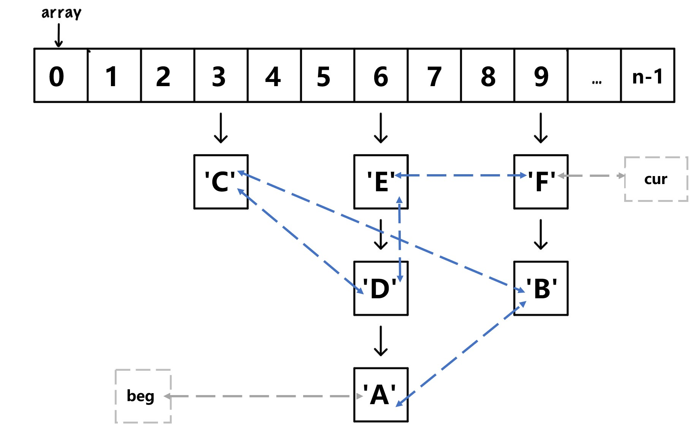

# 3. Linked Hashmap

**时间限制：3s，空间限制：256MB**

## 题目描述

在本题中，你需要实现一个 `LinkedHashMap` 类，下面是对这个类的具体介绍：

下图是 Linked Hashmap 结构的简要说明图，数组 `array` 的每个元素对应一个单链表。我们将 `array[i]` 指向的的结点称为单链表的头结点），单链表最后一个结点称为尾结点。如在 `6` 下方对应的单链表中 `'E'` 为头结点，`'A'` 为尾结点。

除此以外，我们还需要实现一个双向链表（如图中蓝色虚线箭头所示）来维护结点插入单链表的先后顺序。例如，上图的插入顺序依照字典序 `A,B,C,...`。在下面将要给出的代码框架中，我们定义 `beg` 指向双向链表的头结点，`cur` 指向双向链表的尾结点；但你也可以根据自己实现双向链表的习惯，自行修改或删除这两个结点。

我们规定两种方式遍历 Linked Hashmap 中的所有结点：

1. 按照插入的时间从早到晚输出；
2. 按照 `array` 数组的下标从小到大输出。

对于一次测试，遍历 Linked Hashmap 的方式是唯一的，它将会在 `LinkedHashMap` 类被构造后，在初始化函数中指定。每种遍历方式分别对应一个全局函数，而你需要在这两个函数中实现相应的遍历方式。

具体地说：在实现第一种方式时，函数按照结点插入单链表的时间顺序，从早到晚遍历每个结点，并且记录结点中的值；在实现第二种方式时，函数从小到大遍历 `array` 数组的每一个元素，如果它对应的链表不为空，则从头到尾遍历该链表中所有结点，记录结点中的值。

``LinkedHashMap`` 类必须实现下列方法：

- 初始化函数 `void init(int len_, bool forEachByTime)`：主函数会在构造 `LinkedHashMap` 后马上调用它。有两个参数，分别为 `array` 数组的长度和这个类采用的遍历函数。初始化函数会根据传入的长度构造 `array` 数组，其元素类型为 `Node` 类的指针（`Node` 类已在代码框架中给出），并将双链表设置为空，最后根据第二个参数的值确定遍历方式，并且保存相应的函数指针。
- 释放空间的函数 `void clearMemory()`：释放内存空间。主函数将会在退出之前调用它。这个函数需要遍历每个结点，你可以任选上述两种方式中的一种实现这个函数。
- 插入指令 `void insert(int key, std::string value)`：将新的结点插入在上图中 `array[key]` 对应的单链表的 **头部** 以及双链表的 **尾部**。结点中的值为 `std::string` 类型的 `value`。
- 删除操作 `void remove(int key, std::string value)`：删除 `array[key]` 对应的单链表中所有值为 `value` 的结点。若不存在满足要求的结点，请勿对链表做任何改动。不要忘记在双链表中做删除操作！
- 查找操作 `std::vector<std::string> ask(int key) const`：返回的 `vector` 应当包含 `array[key]` 对应的单链表中所有结点的值，顺序为链表的头结点到链表的尾结点。
- 输出链表的全部内容 `std::vector<Data> forEach() const` ：根据所选择的遍历函数遍历所有结点。其中 `Data` 结构体可以理解为 `(key, value)` pair。

建议使用下发的代码框架。

注意：**你不能使用 `auto` 关键字，违者本题计零分**。

## 输入格式

你不需要处理输入，具体情况可参考下发的 `main.cpp`。

## 输出格式

你不需要处理输入，具体情况可参考下发的 `main.cpp`。

## 样例输入

你不需要处理输入，具体情况可参考下发的 `main.cpp`。

## 样例输出

你不需要处理输入，具体情况可参考下发的 `main.cpp`。

## 数据范围

仅有一个对复杂度的要求：删除双向链表中的元素复杂度必须为 $O(1)$。

| Subtask No. | Testcases No. | 考察的内容                                        | 分数 |
| ----------- | ------------- | ------------------------------------------------- | ---- |
| $1$         | $1,2$         | 考察插入和查找                                    | $9$  |
| $2$         | $3,4$         | 考察插入、删除和查找                              | $9$  |
| $3$         | $5,6$         | 考察插入、查找，和按照 `array` 数组下标遍历       | $9$  |
| $4$         | $7,8$         | 考察插入、查找，和按照插入时间顺序遍历            | $9$  |
| $5$         | $9,10,11$     | 考察插入、删除、查找，和按照 `array` 数组下标遍历 | $12$ |
| $6$         | $12,13,14$    | 考察插入，删除、查找，和按照插入时间顺序遍历      | $12$ |
| $7$         | $15, 16$      | 对 Subtask 1 检查内存泄漏                         | $6$  |
| $8$         | $17, 18$      | 对 Subtask 2 检查内存泄漏                         | $6$  |
| $9$         | $19, 20$      | 对 Subtask 3 检查内存泄漏                         | $6$  |
| $10$        | $21, 22$      | 对 Subtask 4 检查内存泄漏                         | $6$  |
| $11$        | $23, 24, 25$  | 对 Subtask 5 检查内存泄漏                         | $8$  |
| $12$        | $26, 27, 28$  | 对 Subtask 6 检查内存泄漏                         | $8$  |
