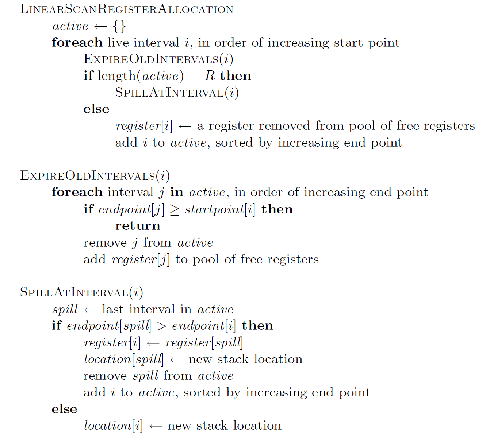

# Linear Scan Register Allocation

*需要提交的文件: `LinearScan.h`。*

## 背景

> 在程序编译过程中，有些变量会储存在**寄存器** (register) 中，有的则不得不存储在内存中，即溢出 (spill) 到**栈槽** (stackslot)中。**寄存器分配** (Register Allocation) 是编译器最重要的优化技术之一，其任务是将程序变量尽可能地分配到寄存器，从而提高程序的性能。
>
> **Linear Scan**算法是一种较为流行的寄存器分配算法。在使用 Linear Scan 进行寄存器分配时，我们会用从1开始递增的正整数表示每条指令的位置 (即**序号**)。同时，我们常常用一个变量的**生命周期** (Live Interval) 来作为其代表，对生命周期而非变量自身进行分配。一个变量的生命周期包括**起点** (start point) 和 **终点** (end point)，皆为指令序号。变量只需在其生命周期内分配存储空间，在生命周期外则不需要。

## 题目描述
你的任务是在提供的框架中实现简易的 Linear Scan Register Allocation。

Linear Scan 的流程大体如下：

- 我们先创建一个存储 interval 的空列表，称作 `active`。 所有寄存器在初始皆为 free 状态。然后我们按 start point 递增的顺序线性扫描所有 live interval。

- 对于每个 interval `i`，我们先释放在 `i` 的 start point 处已经“过期”的 interval 占据的寄存器 (即"Expire Old Intervals")。

- 如果还有 free 的寄存器，则为 `i` 分配一个 free 的寄存器，并将 `i` 加入 `active`；否则，我们将 `active` $\cup$ {`i`} 这个集合中 end point 最大的 interval 溢出到栈上 (即"Spill At Interval")，并为 `i` 分配空出来的寄存器 (若 `i` 被溢出则不需要)。

- 整个过程中，我们需要确保 `active` 按照 end point 递增的顺序排列。

具体流程用伪代码表述如下图所示：



下面将介绍 `LinearScan.h` 中涉及的类以及你需要完成的部分。

### `Location` 类及其派生类 `Register` 类和 `StackSlot` 类
```cpp
class Location {
public:
    // return a string that represents the location
    virtual std::string show() const = 0;
    virtual int getId() const = 0;
};

class Register : public Location {
private:
    // do whatever you want
public:
    Register(int regId) {
        // TODO
    }
    virtual std::string show() const {
        // TODO
    }
    virtual int getId() const {
        // TODO
    }
};

class StackSlot : public Location {
public:
    StackSlot() {}
    virtual std::string show() const {
        // TODO
    }
    virtual int getId() const {
        // TODO
    }
};
```
`Location` 类用于表示 interval 被分配到的存储位置，调用成员函数 `show()` 应返回一个代表该位置的字符串，调用 `getId()` 时，若为 `Register` 类，应返回构造时指定的 id；若为 `StackSLot`类，应返回 `-1`。

对 `Register` 类，其构造函数中`regId` (`slotId`)为该寄存器的id，为一非负整数，调用 `show()` 时应返回 "`reg[regID]`"， 。对 `StackSlot` 类，调用 `show()` 时应返回 "`stack`"。

例如，对以下的程序：
```cpp
Location* p = new Register(42);
std::cout << p->show() << "\n";
std::cout << p->getId() << "\n";
delete p;
p = new StackSlot();
std::cout << p->show() << "\n";
std::cout << p->getId() << "\n";
delete p;
```
应输出：
```plain
reg42
42
stack
-1
```

### `LiveInterval` 类
```cpp
struct LiveInterval {
    int startpoint;
    int endpoint;
    Location* location = nullptr;
};
```
用于表示变量 live interval 的类，三个成员变量分别表示 start point, end point 和分配到的存储位置。

### `LinearScanRegisterAllocator` 类
```cpp
class LinearScanRegisterAllocator {
private:
    // do whatever you want here

    void expireOldIntervals(LiveInterval& i) {
        // TODO
    }
    void spillAtInterval(LiveInterval& i) {
        // TODO
    }
public:
    LinearScanRegisterAllocator(int regNum) {
        // TODO
    }
    void linearScanRegisterAllocate(std::vector<LiveInterval>& intervalList) {
        // TODO
    }
};
```
用于实现 Linear Scan 算法的类。你需要完成构造函数，并按照算法流程完成其他3个函数。构造函数中，`regNum` 是一个正整数，用于表示可用寄存器的数量，且这些寄存器的 id 分别为 `0, 1, ..., regNum-1`。

对于`linearScanRegisterAllocate`函数，传入的参数 `intervalList` 为你需要进行分配的 live interval 的列表，其**已经按照 start point 递增排序**，保证**每个interval的 end point 都不同**。函数返回时，你应该确保 `intervalList` 的顺序与传入时保持一致，且每个 interval 的 `Location` 已被赋予合适的值。

为了确保结果的统一性，我们按照以下规则决定每次具体分配哪个寄存器：**总体栈式分配，按照 FILO(先入后出)的原则，优先分配最晚被释放的 free 寄存器；但如果 free 寄存器都未被分配过，则优先分配 id 最小的寄存器（即初始时栈顶 id 最小，向下 id 依次增大）。**

你可以按照你的需要增加其他函数以及析构函数。

### 提示

实现算法时，你需要维护某些数据结构的有序性。为此，你可以使用 `std::set` 来实现。你也可以用数组或者 `std::vector` 等方式实现，**我们对实现这一点的时间复杂度不做要求**。我们对于内存泄漏不做考察。

你还可能需要**自定义一些比较类**，重载其括号运算符后可以作为模板参数传入 STL 容器。

我们提供了以下资料以供查阅，你可以点击以下超链接来访问这些资料。

- [std::vector - cppreference](assets/std__vector%20-%20cppreference.com.pdf)
- [std::set - cppreference](assets/std__set%20-%20cppreference.com.pdf)

你需要使用 `LinearScan.hpp` 中的模板完成此题。你不应该修改模板已经存在的任何内容（注释除外）；你不应该包含其他头文件。

#### 样例测试程序

```c++
#include "LinearScan.hpp"
#include <vector>
#include <iostream>

int main() {
    LinearScanRegisterAllocator allocator(2);
    std::vector<LiveInterval> intervalList;
    LiveInterval interval;
    interval.startpoint = 1;
    interval.endpoint = 4;
    intervalList.push_back(interval);
    interval.startpoint = 2;
    interval.endpoint = 5;
    intervalList.push_back(interval);
    interval.startpoint = 3;
    interval.endpoint = 9;
    intervalList.push_back(interval);
    interval.startpoint = 5;
    interval.endpoint = 8;
    intervalList.push_back(interval);
    interval.startpoint = 6;
    interval.endpoint = 7;
    intervalList.push_back(interval);
    allocator.linearScanRegisterAllocate(intervalList);
    for (int i = 0; i < intervalList.size(); i++)
        std::cout << "interval " << i+1 << ": " << intervalList[i].location->show() << "\n";
}
```

#### 样例输出

```plain
interval 1: reg0
interval 2: reg1
interval 3: stack
interval 4: reg0
interval 5: reg1
```

### 测试说明
题述的 LinearScan 算法是确定性的，你应该确保你的实现和题目描述一致，我们会根据你的实现与标准实现是否一致进行评测。
保证输入合法。

除 Subtask No.1 外均对 `linearScanRegisterAllocate()` 进行测试。

| Subtask No. | Testcases No. | 主要考察内容 | 评测分数 |
| ----------- | ------------- | ----------- | ------- |
| $1$         |  $1$          |    `Location` 类及其派生类     |    20    |
| $2$         |  $2$          |    保证每个寄存器只会被分配一次、没有溢出    |    10    |
| $3$         |  $3$          |    保证每个寄存器只会被分配一次    |    10    |
| $4$         |  $4$          |    保证没有溢出    |    20    |
| $5$         |  $5, 6$          |    综合测试，`regNum` $\leq 32$,  `intervalList.size()` $\leq 1000$     |    20    |
| $6$         |  $7, 8$          |    压力测试，`regNum` $\leq 10^3$, `intervalList.size()` $\leq 10^5$    |    20    |